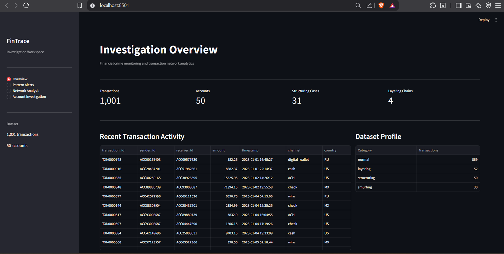
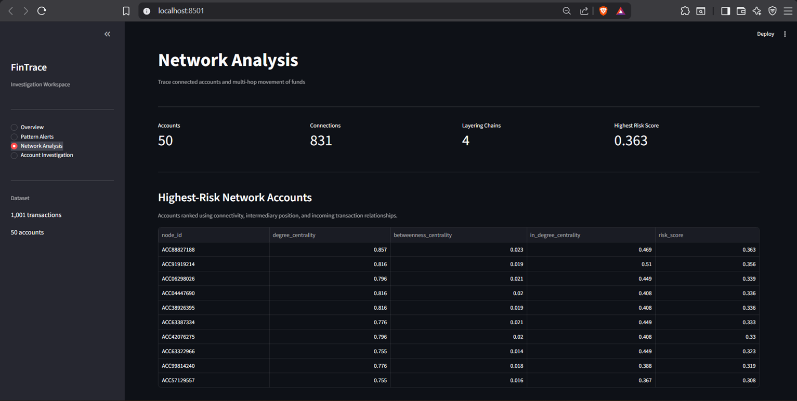
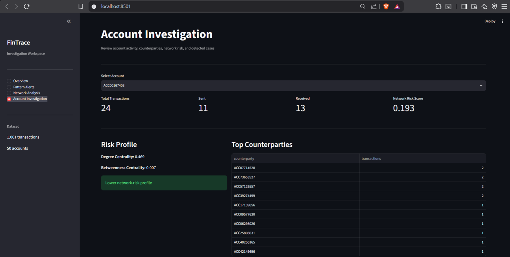

# FinTrace — Financial Crime & Transaction Network Analytics

FinTrace is an investigator-focused financial crime analytics application for analysing transaction behaviour, identifying suspicious patterns, tracing multi-hop fund movements, and reviewing account-level network risk.

The application integrates transaction analytics, network analysis, and an interactive investigation workspace into a single workflow.

---

## Application Overview

FinTrace provides a central workspace for reviewing transaction activity and detected financial crime indicators.



The overview dashboard provides:

- Transaction and account statistics
- Structuring case counts
- Multi-hop layering chain counts
- Recent transaction activity
- Dataset category profile

---

## Key Features

### Pattern Alert Investigation

The alert workspace presents detected transaction behaviours for structured investigator review.

Supported analytical capabilities include:

- Rule-based structuring detection
- Network-based structuring analysis
- Multi-hop layering chain detection
- Transaction velocity analysis
- Network centrality scoring
- Account-level investigation

### Transaction Network Analysis

FinTrace models accounts as nodes and transaction relationships as directed connections.



The network workspace supports:

- Interactive fund-flow visualisation
- Multi-hop transaction path analysis
- Layering-chain exploration
- Network risk ranking
- Central account identification
- Connected-entity review

### Account Investigation

Investigators can select an account and review its activity, relationships, risk indicators, and detected case involvement.



The investigation workflow includes:

- Sent and received transaction analysis
- Network risk scoring
- Degree and betweenness centrality
- Top-counterparty review
- Structuring-case involvement
- Layering-chain involvement
- Transaction history
- System-generated investigation indicators
- Review prioritisation
- Exportable CSV case reports

---

## Investigation Workflow

```text
Transaction Dataset
        |
        v
Pattern Detection
        |
        v
Transaction Network Construction
        |
        +-----------------------+
        |                       |
        v                       v
Structuring Analysis      Layering Analysis
        |                       |
        +-----------+-----------+
                    |
                    v
              Network Scoring
                    |
                    v
          Investigation Workspace
                    |
        +-----------+-----------+
        |           |           |
        v           v           v
      Alerts      Network    Account Review
                                |
                                v
                         Case Report Export
```

---

## Technology Stack

**Data Analysis:** Python, Pandas, NumPy, Scikit-learn

**Network Analytics:** NetworkX, directed transaction graphs, degree centrality, betweenness centrality, multi-hop path analysis

**Application:** Streamlit, Plotly, interactive data tables and dashboards

**Testing:** Pytest with 61 automated tests

---

## Project Structure

```text
FinTrace/
│
├── aml/
│   ├── anomaly.py
│   ├── fraud.py
│   ├── graph.py
│   ├── patterns.py
│   ├── synthetic.py
│   ├── velocity.py
│   └── sql/
│
├── dashboard/
│   └── data_loader.py
│
├── screenshots/
│   ├── Accountinvestigation.png
│   ├── Networkanalysis.png
│   └── Overview.png
│
├── tests/
│
├── app.py
├── transactions.csv
├── requirements.txt
└── README.md
```

---

## Demonstration Dataset

The included synthetic dataset contains 1,001 transactions across 50 accounts.

| Category | Transactions |
| --- | ---: |
| Normal | 869 |
| Layering | 52 |
| Structuring | 50 |
| Smurfing | 30 |
| **Total** | **1,001** |

The dataset includes transaction identifiers, sender and receiver accounts, amounts, timestamps, payment channels, countries, and synthetic behavioural labels.

---

## Current Analysis Results

| Analytical Result | Count |
| --- | ---: |
| Rule-Based Structuring Alerts | 39 |
| Network Structuring Cases | 31 |
| Multi-Hop Layering Chains | 4 |
| Accounts Analysed | 50 |

---

## Installation

### Clone the Repository

```bash
git clone https://github.com/hakeemsallauddin/FinTrace-Financial-Crime-Analytics.git
cd FinTrace-Financial-Crime-Analytics
```

### Create the Environment

```bash
conda create -n fintrace python=3.11 -y
conda activate fintrace
```

### Install Dependencies

```bash
python -m pip install -r requirements.txt
```

### Run FinTrace

```bash
streamlit run app.py
```

---

## Testing

Run the complete test suite:

```bash
python -m pytest tests -v
```

Verified result:

```text
61 passed
```

The test suite covers anomaly scoring, fraud-risk scoring, graph construction, structuring detection, layering detection, pattern analytics, synthetic data generation, SQL rules, and transaction-velocity analysis.

---

## Important Note

FinTrace is an analytical screening and educational application. A flagged transaction, account, or relationship is not proof of financial crime and requires review with supporting evidence.

The demonstration dataset is synthetic and contains no real customer or financial institution data.

---

## Author

**Hakeem Mohammad Sallauddin**

GitHub: `https://github.com/hakeemsallauddin`

LinkedIn: `https://www.linkedin.com/in/hakeem-sallauddin/`